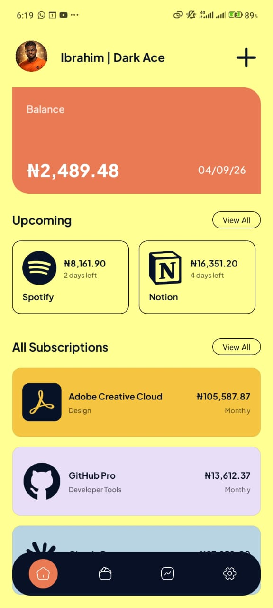
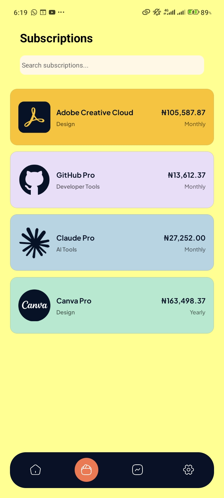
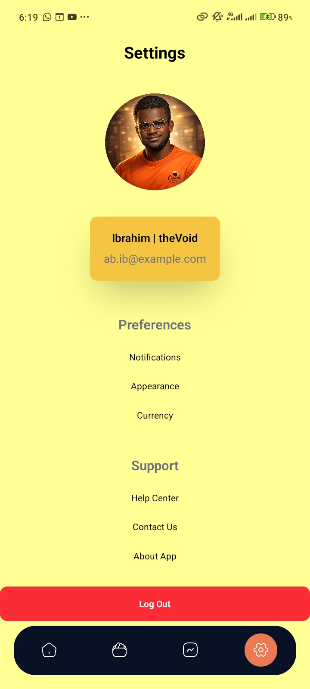

# 📱 Subscription Tracker UI (React Native)

A modern mobile interface built with React Native (Expo) to practice advanced UI design and layout. This is a frontend-focused project created as a learning exercise to translate design concepts into functional components without a backend.

---

## ✨ Features

- 📊 Home screen with subscription overview
- 💳 Subscriptions tab to display active services
- ⚙️ Settings screen UI
- 🧾 Reusable UI components (cards, headings, etc.)
- 🎨 Clean styling with consistent theme and assets

---

## 🛠️ Tech Stack

- React Native (Expo)
- TypeScript
- NativeWind (Tailwind for React Native)

---

## ⚠️ Note

This project is **UI-focused only**:

- No authentication (login/signup are placeholders)
- No backend or API integration
- Some screens (e.g. insights, subscription details) are **placeholders**

---

## 📂 Project Structure (Simplified)

```
recurrly-mobile/
├── app/
│   ├── (auth)/        # Placeholder auth screens
│   ├── (tabs)/        # Main app screens (Home, Subscriptions, Settings)
│   ├── subscriptions/ # Dynamic route (placeholder)
│   ├── _layout.tsx
│   └── onboarding.tsx
├── assets/
│   ├── fonts/
│   ├── icons/
│   ├── images/
│   └── screenshots/
├── components/         # Reusable UI components
├── constants/         # Theme, icons, images, mock data
├── lib/
├── app.json
├── global.css
├── image.d.ts
├── metro.config.js
├── nativewind-env.d.ts
├── package.json
├── README.md
├── tsconfig.json
└── type.d.ts
```

---

## 🚀 Getting Started

### 1. Install dependencies

```bash
npm install
```

### 2. Start the app

```bash
npx expo start
```

### 3. Run on device

- Use **Expo Go** on your phone
- Or run on an emulator

---

## 🎯 Purpose

This project is part of my learning journey in React Native, focusing on:

- UI/UX implementation
- Component structuring
- Styling and layout techniques

---

## 📸 Preview

Screens include:

### Home Page



### Subscriptions Page



### Settings Page



---

## 📌 Future Improvements

- Add backend integration
- Implement authentication
- Enable real subscription tracking logic
- Improve state management

---

🚧 **Status:** UI completed (no backend yet)
